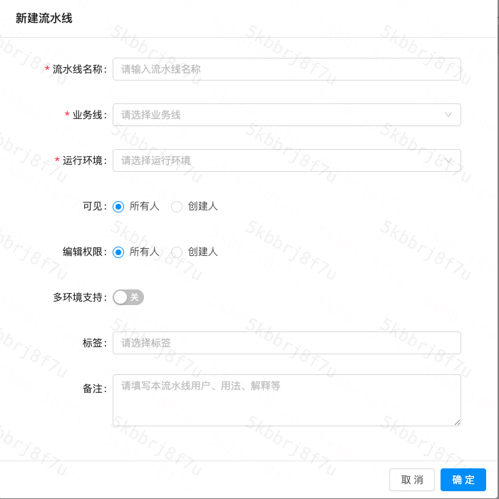
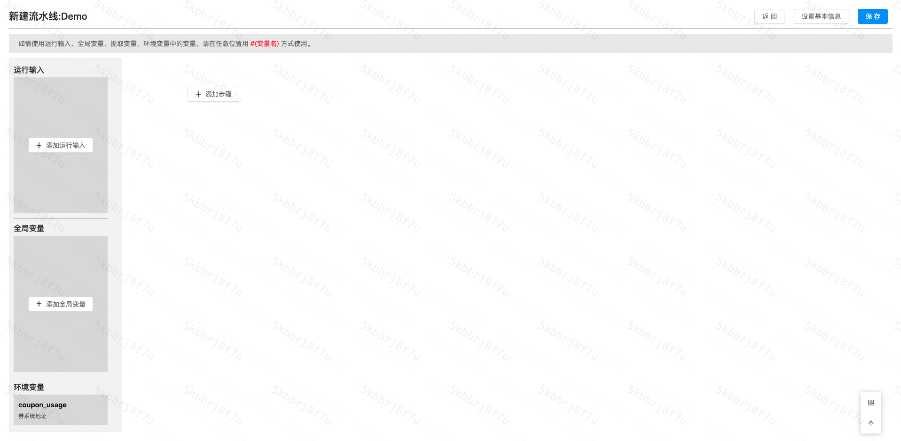
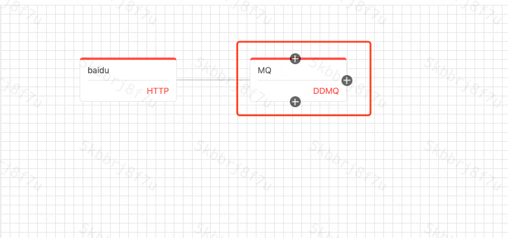
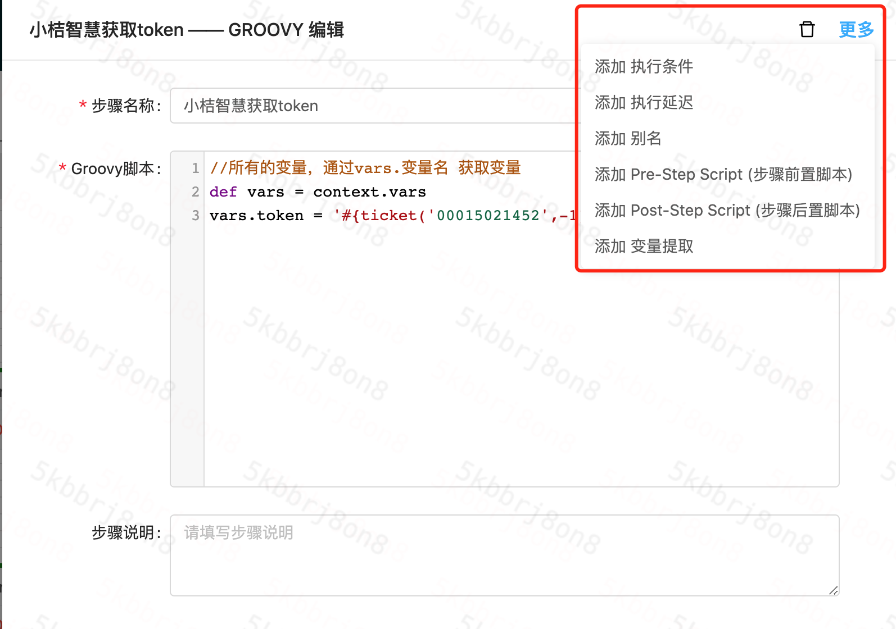

# 快速开始

Daedalus的数据构造是通过流水线形式，现在你需要创建一个流水线。

## 操作

通过首页的**创建流水线**按钮进入流水线创建页面。

### 流水线基本信息

- 流水线名称

  流水线的名称，见名知意

- 业务线

  作为标识、筛选使用

- 运行环境

  **流水线运行环境，由于预发、线上、测试环境隔离，所以要选择正确，如需要调用线上接口请选择线上**

- 可见

  是否所有人可见

- 编辑权限

  是否所有人可以编辑

- 多环境支持

  可能会有多套环境，如测试环境A、测试环境B、预发环境，但是流程是一样的，开启多环境支持流水线只要创建一条，运行时选择环境。

  开启后需要选择使用的环境组，[环境组介绍](环境组.md)。

- 标签

  标记、分类使用。

- 备注

  当前流水线使用介绍，在运行时会显示在运行界面。

### 流水线

点击**添加步骤**，选择**HTTP**，输入<http://www.baidu.com>，**Method**选择**GET**，点击确认，就完成了一个只有一个Step的流水线。

点击保存，然后就可以去运行了。

[更多类型能力介绍](能力.md)

### 复杂流水线

通过流水线每个Step上下右的按钮，添加串行或并行的流水线。

### 更多能力

Step的更多能力在Step编辑页右上角开启。

